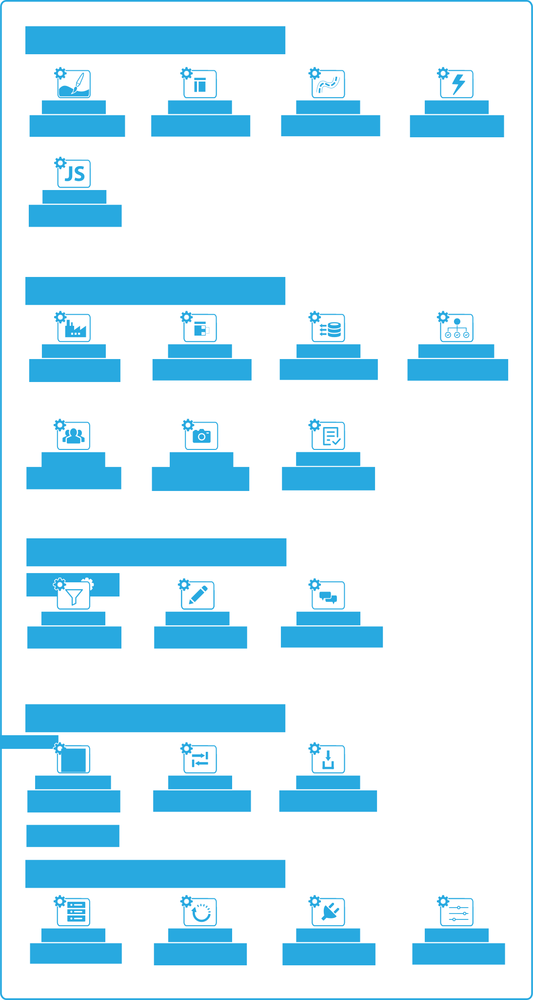
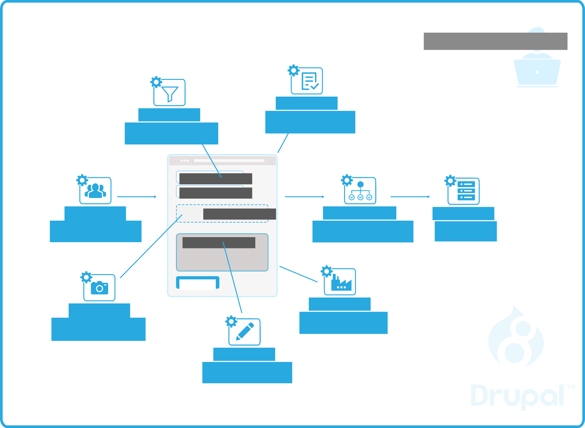
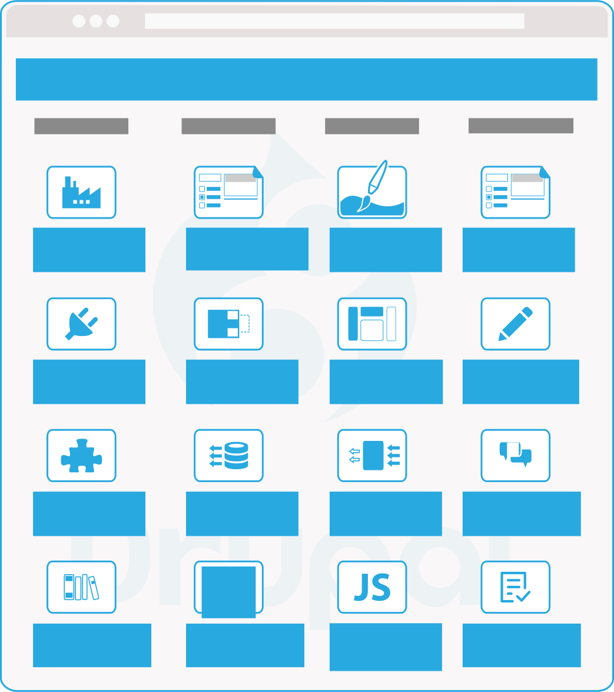
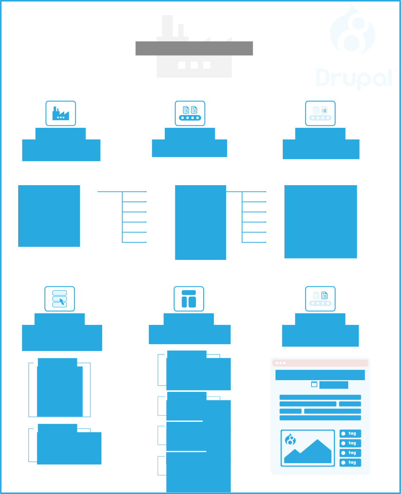
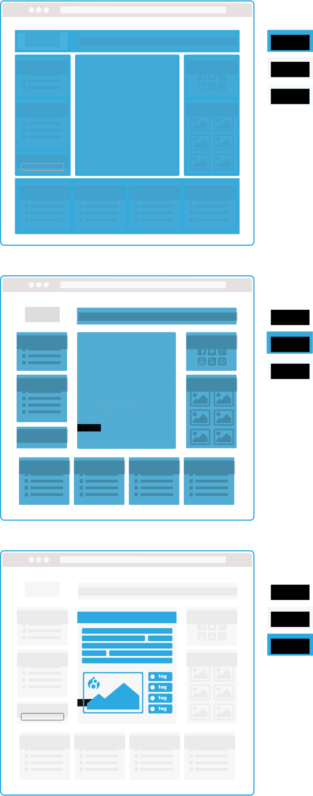
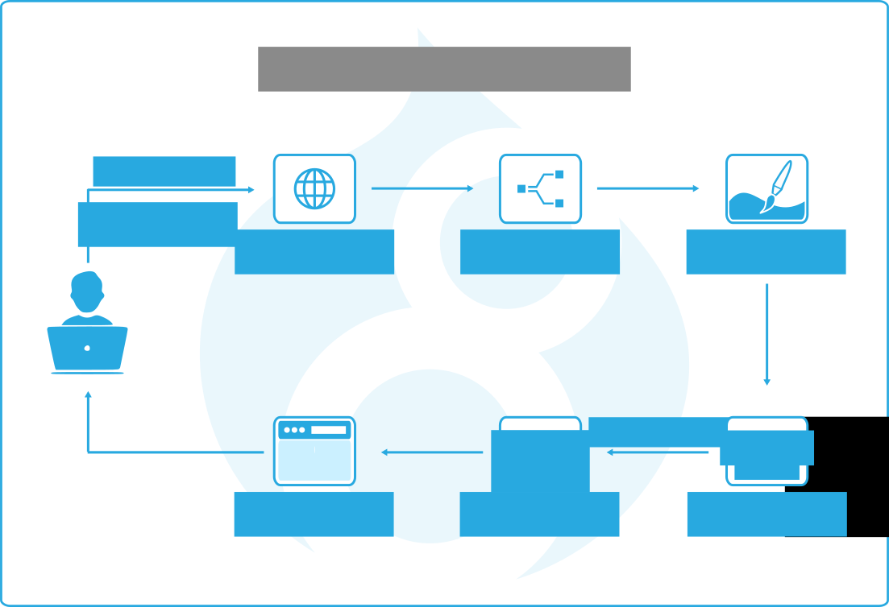
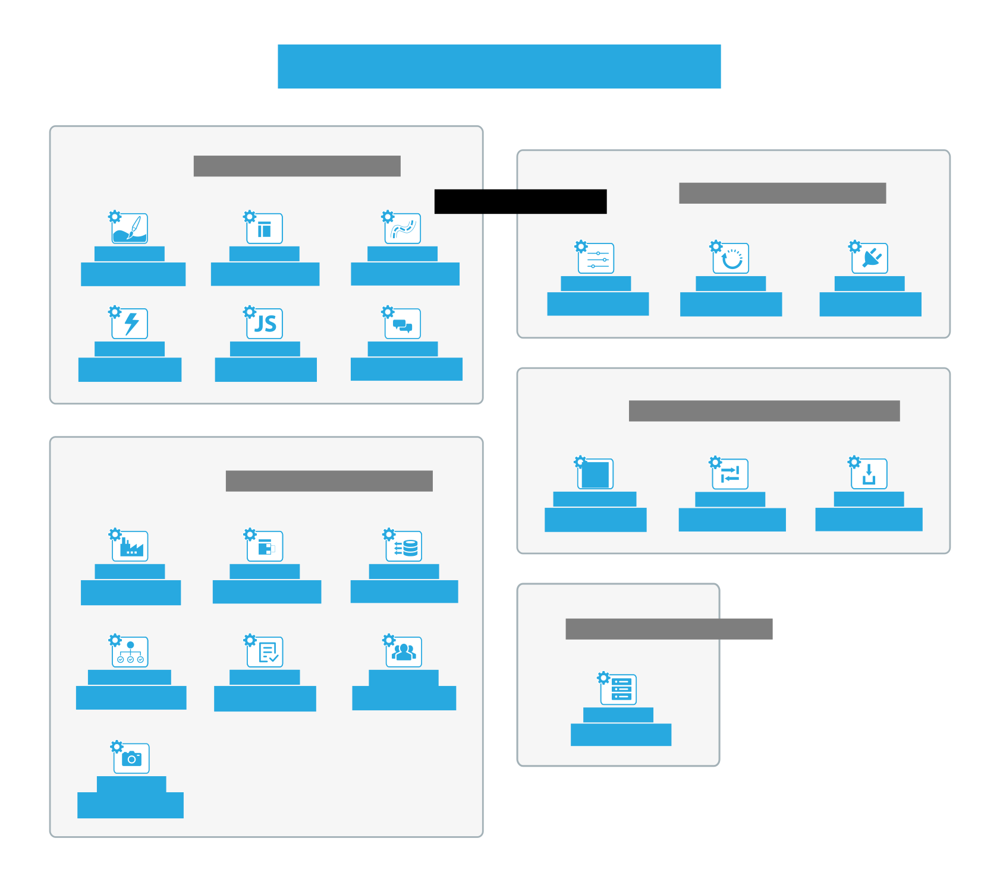

# Drupal Glyphs

## About
> A free to use collection of svg glyphs, illustrations and icons related to **Drupal CMS**. Suitable for presentations, proposals, education materials etc.

## Contents

## Contribute
Feel free to join and propose changes to any of these images by opening an issue or a pull request.

## LICENSE
[GPL V3](LICENSE)

Created with [Inkscape](https://inkscape.org).
