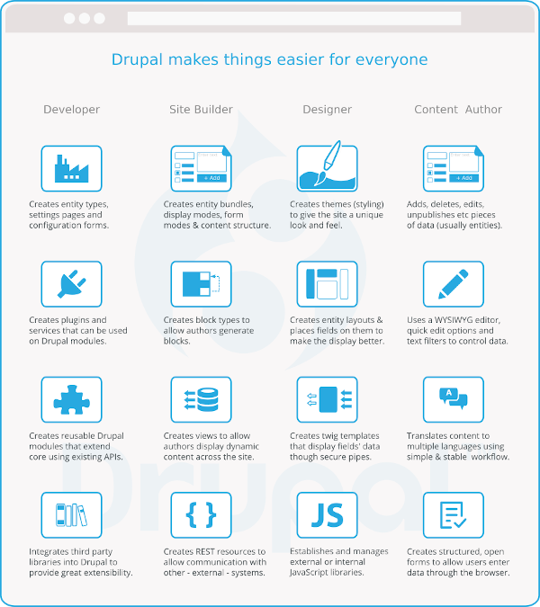

# Drupal Glyphs

## About
> A free to use collection of svg glyphs, illustrations and icons related to **Drupal CMS**. Suitable for presentations, proposals, education materials etc.

## Contents

## Contribute
Feel free to join and propose changes to any of these images by opening an issue or a pull request. The svg images can be found at folder [source](source).

## LICENSE
- [GPL V3](LICENSE)
- Created with [Inkscape](https://inkscape.org).
- [Open Sans](https://www.opensans.com) font is used for texts.
- Drupal is a registered trademark of [Dries Buytaert](https://dri.es).

